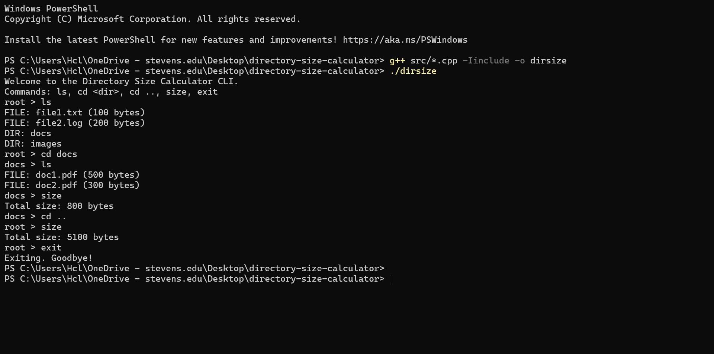
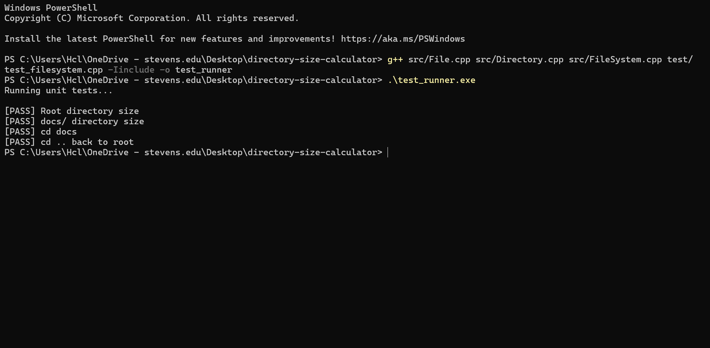

# Directory Size Calculator (C++ CLI Application)

A command-line C++ application that simulates a hierarchical file system with virtual folders and files. It allows you to:

- Navigate between folders ('cd')
- List contents ('ls')
- Recursively calculate total size ('size')

---

## Features

- In-memory virtual file system
- Recursively computes directory sizes
- Command-line navigation ('cd', 'ls', 'size','exit')
- Modular, object-oriented C++ design
- Unit tested for correctness

---

## Design & Architecture

### Core Classes

| Class       | Responsibility                                 |
|-------------|------------------------------------------------|
| 'File'      | Represents a file with name and size           |
| 'Directory' | Stores files, subdirectories, and parent link  |
| 'FileSystem'| Manages the root and current working directory |
| 'main.cpp'  | Handles CLI input and command execution        |

The directory structure is recursive, and each folder can contain both files and child folders (like a real file system). The 'calculateSize()' method uses recursion to traverse the tree structure.

---

## 📂 Folder Structure

directory-size-calculator/

├── include/ # Header files

│ ├── File.h

│ ├── Directory.h

│ └── FileSystem.h

├── src/ # Source files

│ ├── File.cpp

│ ├── Directory.cpp

│ ├── FileSystem.cpp

│ └── main.cpp

├── test/ # Unit tests

│ └── test_filesystem.cpp

└── README.md # Project documentation

└── CMakeLists.txt # CMake build config

├── /assets/

│ ├─── cli-demo.png

  
│ └── test-demo.png

---

## How to Build & Run

### Requirements:
- C++17 or higher
- 'g++' compiler (MinGW on Windows, or g++ on Linux/macOS)

### Compile & Run CLI:

g++ src/*.cpp -Iinclude -o dirsize
./dirsize           # Use .\dirsize.exe on Windows PowerShell

### Run Unit Tests:

g++ src/File.cpp src/Directory.cpp src/FileSystem.cpp test/test_filesystem.cpp -Iinclude -o test_runner
./test_runner       # Or .\test_runner.exe on Windows PowerShell

---

## Sample Commands

root > ls

FILE: file1.txt (100 bytes)

FILE: file2.log (200 bytes)

DIR: docs

DIR: images

root > cd docs

docs > size

Total size: 800 bytes

docs > cd ..

root > cd images

images > size

Total size: 4000 bytes

images > exit

Exiting. Goodbye!

---

## Tests Included

| Test                           | Purpose                               |
| ------------------------------ | ------------------------------------- |
| Root directory size            | Validates recursive size computation  |
| docs/ directory size           | Tests size of a subfolder             |
| Navigation with 'cd' / 'cd ..' | Verifies movement between directories |

---

## Build with CMake (Alternative)
If you prefer using CMake for cleaner builds:

# Step 1: Create and move into a build folder
mkdir build
cd build

# Step 2: Generate build files with CMake
cmake ..

# Step 3: Build the project
cmake --build .

# Step 4: Run the app or tests
./dirsize        # or .\dirsize.exe on Windows
./test_runner    # or .\test_runner.exe

CMake will automatically find and build everything defined in CMakeLists.txt.

---

## Screenshots

### CLI in Action

### Unit Tests

